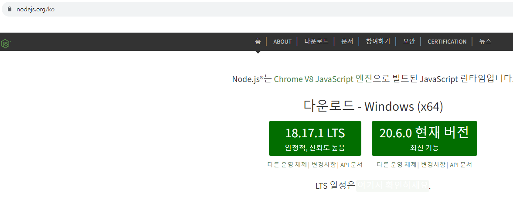
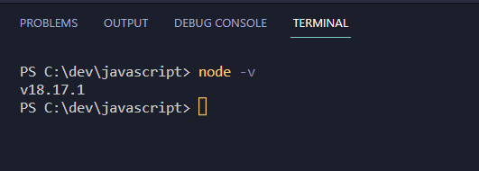

# 자바스크립트란?

---

#### 자바스크립트는 (1) 언어이다.

#### (1)언어는 (2)파일에 include하여 실행된다.

#### (2)파일이 실행하는 환경은(3)이다.

#### (3)에서 (1)이 실행되는 이유는 (4)을 탑재하고 있기 때문이다.

#### (4)의 실행방식은(5)이다.

#### (5)는 런타임시 한줄씩 코드를 읽어서 바로 실행한다.

#### (1)script

#### (2)html

#### (3)web browser

#### (4)엔진

#### (5)인터프리터

# node js 설치



node js lts 버전으로 설치

---



설치완료 후 터미널에서 node -v 명령어로 버전확인가능

터미널에서 node 파일명.js 로 연결가능

---

# var - function scope variable

```
for (var i = 0; i < 10; i++) {
  var leak = "I am available outside of the loop";
}
console.log(i);
console.log(leak);

function myfunction() {
  var fscope = "I am available inside this function";
  console.log(fscope);
}
console.log(fscope); //에러 발생, 함수 스코프 영역을 벗어남
```

#### 함수 {}중괄호 안에 설정된 변수는 함수 안에서 지역변수로 선언되어 밖에서 호출이 되지 않는다.

```
  var fscope = "I am available inside this function";
function myfunction() {
  console.log(fscope);
}
console.log(fscope); //에러 안남
```

```
<!-- let - block scope variable  -->
let x = "global";
if (x === "global") {
  let x = "block";
  console.log(x); //block-scope
}
console.log(x); //global-scope

<!--  var - function scope variable -->
var y = "global";
if (y === "global") {
  var y = "block-scope";
  console.log(y); //"block-scope"
}
console.log(y); //"block-scope"
```

---

```
/** const - block scope variable */
const z = "I am a constant";
//z = "I can't be reassign";

console.log(z);

/** const - 객체 정의 */
const person = {
    name : "홍길동",
    age : 30
};

person.age = 35;
console.log(person.age);
```

---

# const

```
/** const - block scope variable */
const z = "I am a constant";
//z = "I can't be reassign";

console.log(z);

/** const - 객체 정의 */
const person = {
    name : "홍길동",
    age : 30
};

person.age = 35;
console.log(person.age);
```

아래 const 객체 const person은 callstack에 {} 중괄 호안의 값에 주소값을 갖고 존재한다.
중괄호 안의 값은 M.H에 존재하게 된다.

---

# TDZ(Temporal Dead Zone)

```
name;
console.log(i); //선언과 초기화됨 (es5문법)
var i = "I am a var";

console.log(j); //초기화 x var선언이면 undefine
let j = "I am a let"; //ReferenceError: Cannot access 'j' before initialization
```

es6문법에서는 var 비선호 let 과 const를 사용할것

---

# ES5 function syntax

```
function greeting1(name) {
  return "greeting1 : hello~" + name;
}
```

es5에서는 'function'키워드가 있으면 heap에 저장된다고 간주, 화살표 함수도 같은 방식으로 저장

```
const greeting2 = function (name) {
  return "greeting2 : hello~" + name;
};

var greeting3 = (name) => {
  return "greeting3 : hello~" + name;
};

var greeting4 = () => {
  return "greeting4 : hello~";
};
```

{} 중괄호 안은 memory heap에 저장

#### 함수의 명시적 호출

console.log(greeting1("홍길동"));
console.log(greeting2("홍길동"));
console.log(greeting3("홍길동"));
console.log(greeting4());

# es5,es6 default value

#### ES5 function default value

---

function getLocation(city, country, continent) {
//식별자 앞에 아무것도 없으면 var랑 같음
if (typeof country === "undefined") {
country = "Italy";
}
if (typeof continent === "undefined") {
continent = "Europe";
}
console.log(continent, country, city);
}

getLocation("Milano");
getLocation("Paris", "France");
console.log("\n");

---

---

#### ES6 function default value

---

function getLocation2(city, country = "Italy", continent = "Europe") {
console.log(continent, country, city);
}

getLocation2("Milano");
getLocation2("Paris", "France");

# TemlateLiteral

#### 중첩 템플릿

---

배열은 동일한 데이터타입을 물리적으로 연속된 저장소에 저장한다.

```
const people = [
  { name: "홍길동", age: 27 },
  { name: "홍홍", age: 27 },
  { name: "홍길순", age: 31 },
];

const markup = `
<ul>
    ${people.map((person) => `<li> ${person.name} </li>`)}
</ul>
`;
console.log(markup);
```

---

---

#### 삼항 연산자 추가하기 1

---

```
const isDiscounted = false;

function getPrice() {
  console.log(isDiscounted ? "$10" : "$20");
}

getPrice();
```

#### 삼항 연산자 추가하기 2

```
const artist = {
  //name, age와 함께 artist 객체 생성
  name: "잔나비",
  age: 20,
  song: "주저하는 연인들을 위해",
};

//artist 객체에 song 프로퍼티가 있을 때만 문장에 추가하고,
//없으면 아무것도 반환하지 않음
const text = `
    <div>
        <p>${artist.name} : ${artist.age}살 </p>
        ${artist.song ? `<p>대표곡 :  ${artist.song}</p>` : ""}
    </div>
`;
console.log(text);
```

# 템플릿 리터럴에 함수 전달하기

```
const groceries = {
  meat: "pork chop",
  veggie: "salad",
  fruit: "apple",
  others: ["murshrooms", "instant noodles", "instant soup"],
};

//groceries의 각  값에 대해 map()을 수행하는 함수
function groceryList(others) {
  return `
      <p>
      ${others.map(
        (abc) => `<div>
        <p>${abc}</p>
        </div>`
      )}.join('\n')
      </p>
  `;
}
/*  ${others.map((other) => `<span>${other}</span>`).join("\n")} */

//p 태그 내  모든 groceries를 출력. 마지막은 **others** 배열의 모든 원소를 포함
const markup = `
  <div>
      <p>${groceries.meat}</p>
      <p>${groceries.veggie}</p>
      <p>${groceries.fruit}</p>
      <p>${groceryList(groceries.others)}</p>
  </div>
`;

console.log(markup);
```

# 태그된 템플릿 리터럴

```
let person = "hong";
let age = 25;
/* callbyvalue 값을 바로 가져옴 따라서 heap에 생성되지않음  */

function myTag(strings, personName, personAge) {
  //strings : ['That ',' is a',' !!']
  let str = strings[1]; //'is a'
  let ageStr;

  personAge > 50 ? (ageStr = "grandPa") : (ageStr = "youngster");

  return personName + str + ageStr;
}

let sentence = myTag`That ${person} is a ${age}!!`;
console.log(sentence); //hong is a youngster
```
