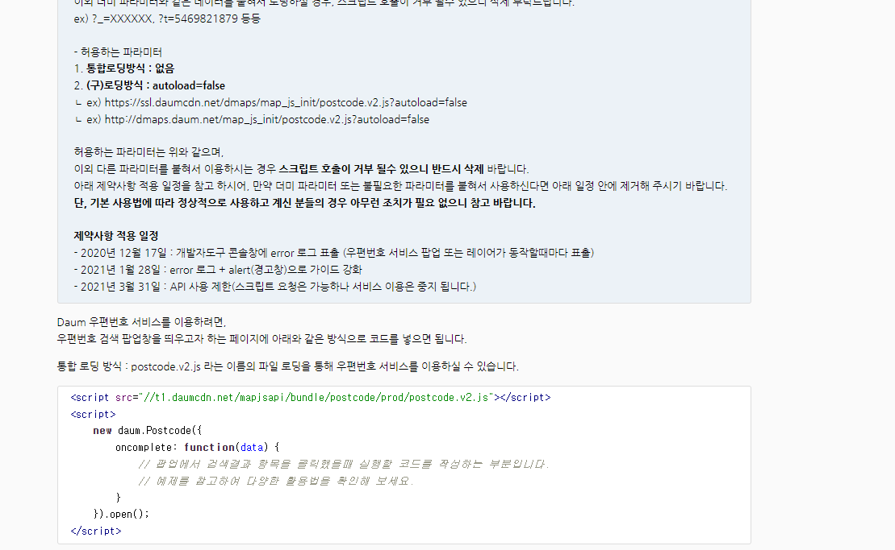

# 1

----주소검색 api -------


https://postcode.map.daum.net/guide
다음 주소검색 api
키값별도로 필요없음 무료로 사용가능

# 2 Scope

Jascript:ES6(ECMA Script 6)
ECMA ?1995년에 자바스크립트를 만들어졌을때 넷스케이프에서 만들어졌지만 다른회사랑 표준규약을 맞추기위해 정의를 함
1)Basic(문법) - let,const
function,class,iterator,...
2)Advance(내부구현) - Scope,Hoisting,Closer,Prototype..

### \*Scope란 ?

#### -식별자(변수,함수,클래스 등)의 유효한 범위,영역

#### -변수를 참조할 수 있는 유효한 범위, 영역

#### -스코프정의 - {} (블럭) 정의 단위로 정의됨

#### -블럭 : 블럭({}),함수(function a(){}),제어문(for{},if{})

#### -블럭 내부에서 블럭 외부의 변수를 참조가능,

#### -블럭 외부에서 블럭 내부의 변수는 참조 불가능

```
scope.js
----------
const a = 200; // 글로벌(전역) 변수 scope.js끝날때까지 유효함
{
  const a = 100; //로컬(멤버)변수 블럭이 끝날때까지만 유효함
  console.log(a); // 100이 출력
}

console.log(a); // 200이 출력

```

scope 이 다른 경우이기 때문에 이름이 같아서 에러는 발생하지 않는다.
<br/>--> 이름 충돌방지, 식별자의 범위를 scope으로 지정,제한하며 메모리 효율성을 높일 수 있다.
<br/>블럭이 끝나면 참조하는 값이 없어지기때문에 가비지컬렉터의 대상이 됨

### 결론 : 식별자(변수)는 최대한 필요한 블럭에서 정의해서 사용하도록 한다!

---

### 만약에 a = 100 값이 블럭안에서 선언되지 않았다면?

```
const a = 200; // 글로벌(전역) 변수 scope.js끝날때까지 유효함
{
  console.log(a); // 200이 출력
}

console.log(a); // 200이 출력
```

블럭밖의 전역변수 a의 값을 참조해서 출력한다

### 만약에 전역변수값이 없고 블럭안의 로컬변수만 있었다면 ?

```
{
  const a = 100; //로컬(멤버)변수 블럭이 끝날때까지만 유효함
  console.log(a); // 100이 출력
}

console.log(a); // 정의되지 않음
```

## scope 함수 예시

```
1번
function print() {
  const message = "Hello~ JavasScript";
  console.log(message); // "Hello~ JavasScript" 출력
}
print();
/* console.log(message); */ // 에러발생
```

```
const a = 100;
const b = 300;
function sum(a, b) {
  console.log(a + b); //3출력
}
sum(1, 2);
console.log(a + b); // 400 출력
```

```
for (let i = 0; i < 10; i++) {
  console.log(i);
}
console.log(i); // 레퍼런스 에러
```

scope와 관계없이 가독성을 위해 이름은 충돌이 발생하지 않더라도 가급적 다른이름으로 적용하는게 좋다.

```
const text = "global";
{
   console.log(text); // 에러발생
  const text = "local";

  {
    console.log(text); // local 출력
  }
}
// console.log(text); // global 출력
```

/_ -------오후수업_------------ _/
/_

# 가비지 컬렉터(Garbage Collector)

- C언어 - 개발자가 메모리 선언,할당, 데이터처리,메모리 삭제(반환)
- JAVA,C#,JS,Go - 메모리 관리해주는 GC(garbage Collector) 가짐 \*동작시점 : 가비지콜렉터가 가지고있는 임계치에 도달하게되면 백그라운드에서 실행된다.
  (대상이 된다고 바로 동작/실행이 되는것은 아니다.)

```
let apple = {
  name: "apple",
};

let orange = apple;
apple = null;
orange = null;
```

### gc의 대상은 ? memory heap 에 생성된 객체이다.

## 실행 컨텍스트(Execution context)

#### - 실행 순서와 스코프를 기억하고 있음

#### - 실행 컨텍스트는 스코프정보를 가지있는

#### 렉시켤 환경 오브젝트를 생성하여 관리하며

#### 렉시컬 환경 오브젝트는 각각의 스코프 체이닝으로 연결됨

#### -코드 맨 안쪽의 블럭이 맨 먼저 생성됨

---

# 스코프란 ?

식별자(함수,변수,제어문)의 유효한 범위를 참조할 수 있는 {}블럭 단위로 구분 된 영역이다. <br/>
스코프는 이름 충돌 방지의 기능도 있지만 블럭이 끝나면 참조하는 값이 없어져 가비지컬렉터의 대상이 되므로,<br/>
스코프로 식별자의 범위를 제한하여 메모리 효율성을 높일 수 있다. <br/>
스코프 내부의 식별자는 참조가 불가능하지만, 내부에서 외부스코프의 식별자는 참조가 가능합니다. 참조가 가능한 이유는 <br/>
실행컨텍스트에 있는 렉시컬 환경 오브젝트가 스코프단위로 정보를 기억하고 있으며 맨 안쪽에 생성되는 스코프 부터 체이닝을 이용하여 연결되어 있기 떄문입니다.<br/>
그래서 스코프를 사용할 때 메모리 절약과 성능을 고려한다면 식별자 선언과 사용은 필요한 블럭에서 정의하고 호출하도록 하는것이 좋다고 생각합니다.<br/>
