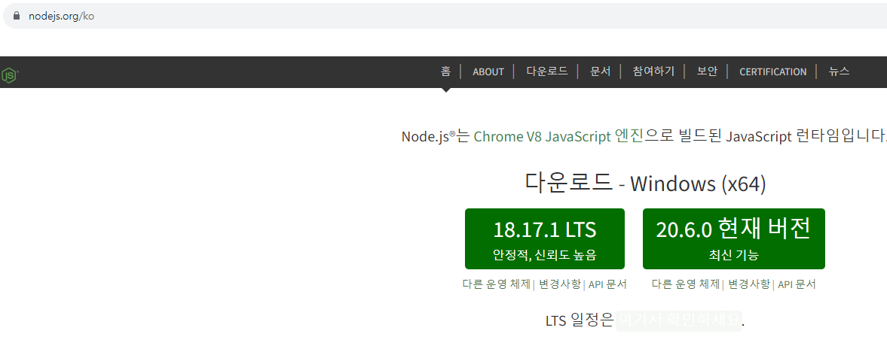

# 자바스크립트란?

---

#### 자바스크립트는 (1) 언어이다.

#### (1)언어는 (2)파일에 include하여 실행된다.

#### (2)파일이 실행하는 환경은(3)이다.

#### (3)에서 (1)이 실행되는 이유는 (4)을 탑재하고 있기 때문이다.

#### (4)의 실행방식은(5)이다.

#### (5)는 런타임시 한줄씩 코드를 읽어서 바로 실행한다.

#### (1)script

#### (2)html

#### (3)web browser

#### (4)엔진

#### (5)인터프리터

# node js 설치

node js lts 버전으로 설치

---

설치완료 후 터미널에서 node -v 명령어로 버전확인가능

터미널에서 node 파일명.js 로 연결가능
