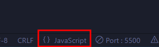

# kobis api (1/2)

#### json 파일 정렬



```
const kobis = {
  boxOfficeResult: {
    boxofficeType: "일별 박스오피스", //kobis.boxOfficeResult.boxofficeType
    showRange: "20230906~20230906", //kobis.boxOfficeResult.showRange
    dailyBoxOfficeList: [
      {
        rnum: "1",
        rank: "1", //kobis.boxOfficeResult.dailyBoxOfficeList[i].rank
        rankInten: "25",
        rankOldAndNew: "OLD",
        movieCd: "20224667",
        movieNm: "잠", //kobis.boxOfficeResult.dailyBoxOfficeList[0].movieNm
        openDt: "2023-09-06",
        salesAmt: "735086507",
        salesShare: "44.9",
        salesInten: "733556507",
        salesChange: "47944.9",
        salesAcc: "814820407",
        audiCnt: "79435",
        audiInten: "79265",
        audiChange: "46626.5",
        audiAcc: "87543",
        scrnCnt: "1072",
        showCnt: "4947",
      },
      {
        rnum: "2",
        rank: "2",
        rankInten: "-1",
        rankOldAndNew: "OLD",
        movieCd: "20226431",
        movieNm: "오펜하이머",
        openDt: "2023-08-15",
        salesAmt: "209727019",
        salesShare: "12.8",
        salesInten: "-21184712",
        salesChange: "-9.2",
        salesAcc: "30316354087",
        audiCnt: "19831",
        audiInten: "-2577",
        audiChange: "-11.5",
        audiAcc: "2841435",
        scrnCnt: "879",
        showCnt: "2367",
      },
      {
        rnum: "3",
        rank: "3",
        rankInten: "0",
        rankOldAndNew: "OLD",
        movieCd: "20226500",
        movieNm: "달짝지근해: 7510",
        openDt: "2023-08-15",
        salesAmt: "125541095",
        salesShare: "7.7",
        salesInten: "-27331297",
        salesChange: "-17.9",
        salesAcc: "11338836912",
        audiCnt: "13662",
        audiInten: "-2967",
        audiChange: "-17.8",
        audiAcc: "1165302",
        scrnCnt: "697",
        showCnt: "1841",
      },
      {
        rnum: "4",
        rank: "4",
        rankInten: "-2",
        rankOldAndNew: "OLD",
        movieCd: "20233014",
        movieNm: "타겟",
        openDt: "2023-08-30",
        salesAmt: "118797823",
        salesShare: "7.3",
        salesInten: "-67443709",
        salesChange: "-36.2",
        salesAcc: "2963671983",
        audiCnt: "12990",
        audiInten: "-7053",
        audiChange: "-35.2",
        audiAcc: "314638",
        scrnCnt: "766",
        showCnt: "2125",
      },
      {
        rnum: "5",
        rank: "5",
        rankInten: "-1",
        rankOldAndNew: "OLD",
        movieCd: "20204264",
        movieNm: "콘크리트 유토피아",
        openDt: "2023-08-09",
        salesAmt: "114860158",
        salesShare: "7.0",
        salesInten: "-28954320",
        salesChange: "-20.1",
        salesAcc: "35719917721",
        audiCnt: "12362",
        audiInten: "-3041",
        audiChange: "-19.7",
        audiAcc: "3657632",
        scrnCnt: "717",
        showCnt: "2012",
      },
      {
        rnum: "6",
        rank: "6",
        rankInten: "0",
        rankOldAndNew: "NEW",
        movieCd: "20090379",
        movieNm: "해리 포터와 혼혈 왕자",
        openDt: "2009-07-15",
        salesAmt: "70743500",
        salesShare: "4.3",
        salesInten: "70743500",
        salesChange: "100",
        salesAcc: "20338227500",
        audiCnt: "6339",
        audiInten: "6339",
        audiChange: "100",
        audiAcc: "2964075",
        scrnCnt: "41",
        showCnt: "214",
      },
      {
        rnum: "7",
        rank: "7",
        rankInten: "-2",
        rankOldAndNew: "OLD",
        movieCd: "20218541",
        movieNm: "밀수",
        openDt: "2023-07-26",
        salesAmt: "37207927",
        salesShare: "2.3",
        salesInten: "-25159483",
        salesChange: "-40.3",
        salesAcc: "49166017434",
        audiCnt: "3991",
        audiInten: "-2698",
        audiChange: "-40.3",
        audiAcc: "5089666",
        scrnCnt: "420",
        showCnt: "626",
      },
      {
        rnum: "8",
        rank: "8",
        rankInten: "0",
        rankOldAndNew: "NEW",
        movieCd: "20211540",
        movieNm: "듣보인간의 생존신고",
        openDt: "2023-09-06",
        salesAmt: "32409900",
        salesShare: "2.0",
        salesInten: "32409900",
        salesChange: "100",
        salesAcc: "42978900",
        audiCnt: "3503",
        audiInten: "3503",
        audiChange: "100",
        audiAcc: "4788",
        scrnCnt: "72",
        showCnt: "97",
      },
      {
        rnum: "9",
        rank: "9",
        rankInten: "-3",
        rankOldAndNew: "OLD",
        movieCd: "20228930",
        movieNm: "엘리멘탈",
        openDt: "2023-06-14",
        salesAmt: "20281885",
        salesShare: "1.2",
        salesInten: "-10305296",
        salesChange: "-33.7",
        salesAcc: "70145608677",
        audiCnt: "2202",
        audiInten: "-1026",
        audiChange: "-31.8",
        audiAcc: "7138995",
        scrnCnt: "247",
        showCnt: "317",
      },
      {
        rnum: "10",
        rank: "10",
        rankInten: "5",
        rankOldAndNew: "OLD",
        movieCd: "20231253",
        movieNm: "일주일간 친구",
        openDt: "2023-09-06",
        salesAmt: "17372250",
        salesShare: "1.1",
        salesInten: "15230250",
        salesChange: "711",
        salesAcc: "98192250",
        audiCnt: "1936",
        audiInten: "1630",
        audiChange: "532.7",
        audiAcc: "8009",
        scrnCnt: "133",
        showCnt: "321",
      },
    ],
  },
};

//일별 박스오피스 출력 - 영화순위,영화제목, 개봉일,누적관객수,누적매출액
let movieList = kobis.boxOfficeResult.dailyBoxOfficeList;
let movieBox = document.querySelector(".movie-box");
movieList.map((v) => {
  let { rank, movieNm, openDt, audiAcc, salesAcc, rankOldAndNew, rankInten } = v;
  let newOld = rankOldAndNew == "NEW" ? "신규" : "기존";
  let rankUpDown = rankInten > 0 ? `+${rankInten}` : `${rankInten}`;

  return movieBox.insertAdjacentHTML(
    "beforeend",
    `
    <div class="card" style="width: 18rem;">
    <p class="card-img-top">${kobis.boxOfficeResult.boxofficeType}</p>
    <div class="card-body">
      <h5 class="card-title"><strong>${newOld} ${rank}위</strong>(${rankUpDown})</h5>
     <h4 class='title-line'> ${movieNm}</h4>
      <p class="card-text"><p><strong>개봉일</strong> : ${openDt}</p>
    <p><strong>누적관객</strong> : ${audiAcc}명</p>
      <p><strong>누적매출</strong> : ${salesAcc}원</p></p>
      <a href="#" class="btn btn-primary">영화상세보기</a>
    </div>
  </div>
  `
  );
});

document.querySelectorAll(".btn").forEach((v) => {
  v.addEventListener("click", () => {
    alert("연습용 페이지입니다. 상세보기 정보가 없습니다.");
  });
});
```

---

#### https://www.kobis.or.kr/kobisopenapi/homepg/main/main.do 영화진흥위원회 kobis api 데이터를 이용해 작성하였습니다.

# DOMContentLoaded 이벤트

window.addEventListener("DOMContentLoaded", (event) => {
console.log("DOM fully loaded and parsed");
});
document.addEventListener("DOMContentLoaded", execkobis);
//DOM 객체 생성 후 execkogix 함수 호출

# kobis api (2/2)

#### json파일 fetch로 연동하여 코드 줄이기

```
const getKobis = async () => {
  await fetch(
    "https://kobis.or.kr/kobisopenapi/webservice/rest/boxoffice/searchDailyBoxOfficeList.json?key=f5eef3421c602c6cb7ea224104795888&targetDt=20060906"
  )
    .then((response) => response.json())
    .then((kobis) => {
      console.log(kobis);
      //일별 박스오피스 출력 - 영화순위,영화제목, 개봉일,누적관객수,누적매출액
      let movieList = kobis.boxOfficeResult.dailyBoxOfficeList;
      let movieBox = document.querySelector(".movie-box");
      movieList.map((v) => {
        let { rank, movieNm, openDt, audiAcc, salesAcc, rankOldAndNew, rankInten } = v;
        let newOld = rankOldAndNew == "NEW" ? "신규" : "기존";
        let rankUpDown = rankInten > 0 ? `+${rankInten}` : `${rankInten}`;

        return movieBox.insertAdjacentHTML(
          "beforeend",
          `
    <div class="card" style="width: 18rem;">
    <p class="card-img-top">${kobis.boxOfficeResult.boxofficeType}</p>
    <div class="card-body">
      <h5 class="card-title"><strong>${newOld} ${rank}위</strong>(${rankUpDown})</h5>
     <h4 class='title-line'> ${movieNm}</h4>
      <p class="card-text"><p><strong>개봉일</strong> : ${openDt}</p>
    <p><strong>누적관객</strong> : ${audiAcc}명</p>
      <p><strong>누적매출</strong> : ${salesAcc}원</p></p>
      <a href="#" class="btn btn-primary">영화상세보기</a>
    </div>
  </div>
  `
        );
      });

      document.querySelectorAll(".btn").forEach((v) => {
        v.addEventListener("click", () => {
          alert("연습용 페이지입니다. 상세보기 정보가 없습니다.");
        });
      });
    });
  // .catch();
};
getKobis();
```
