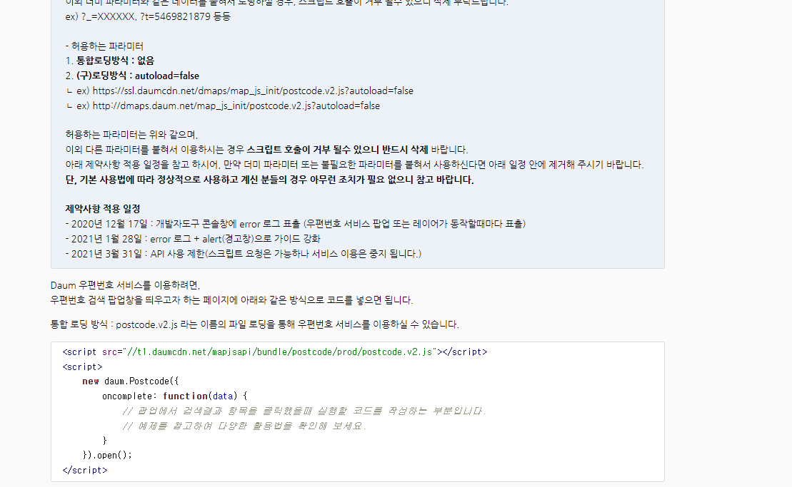

# 1

----주소검색 api -------


https://postcode.map.daum.net/guide
다음 주소검색 api
키값별도로 필요없음 무료로 사용가능

# 2 Scope

Jascript:ES6(ECMA Script 6)
ECMA ?1995년에 자바스크립트를 만들어졌을때 넷스케이프에서 만들어졌지만 다른회사랑 표준규약을 맞추기위해 정의를 함
1)Basic(문법) - let,const
function,class,iterator,...
2)Advance(내부구현) - Scope,Hoisting,Closer,Prototype..

### \*Scope란 ?

#### -식별자(변수,함수,클래스 등)의 유효한 범위,영역

#### -변수를 참조할 수 있는 유효한 범위, 영역

#### -스코프정의 - {} (블럭) 정의 단위로 정의됨

#### -블럭 : 블럭({}),함수(function a(){}),제어문(for{},if{})

#### -블럭 내부에서 블럭 외부의 변수를 참조가능,

#### -블럭 외부에서 블럭 내부의 변수는 참조 불가능

```
scope.js
----------
const a = 200; // 글로벌(전역) 변수 scope.js끝날때까지 유효함
{
  const a = 100; //로컬(멤버)변수 블럭이 끝날때까지만 유효함
  console.log(a); // 100이 출력
}

console.log(a); // 200이 출력
```

### 만약에 a = 100 값이 블럭안에서 선언되지 않았다면?

```
const a = 200; // 글로벌(전역) 변수 scope.js끝날때까지 유효함
{
  console.log(a); // 200이 출력
}

console.log(a); // 200이 출력
```

블럭밖의 전역변수 a의 값을 참조해서 출력한다

### 만약에 전역변수값이 없고 블럭안의 로컬변수만 있었다면 ?

```
{
  const a = 100; //로컬(멤버)변수 블럭이 끝날때까지만 유효함
  console.log(a); // 100이 출력
}

console.log(a); // 정의되지 않음
```
